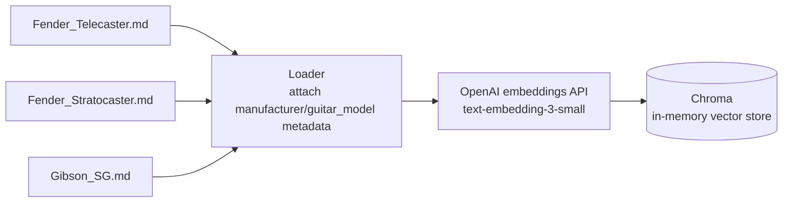
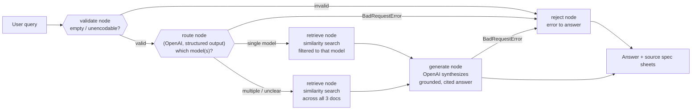
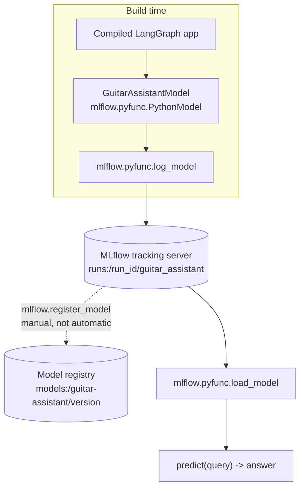
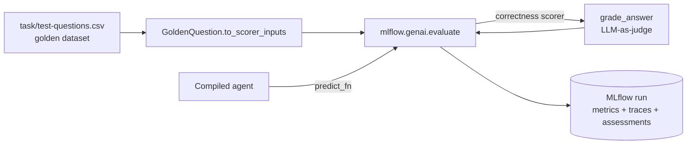

# Architecture

Diagrams are plain ` ```mermaid ` fenced code blocks, rendered natively by GitHub
and [VSCode's Mermaid preview extension](https://marketplace.visualstudio.com/items?itemName=bierner.markdown-mermaid).

## Design philosophy

The source corpus is three small Markdown files (`Fender_Telecaster.md`,
`Fender_Stratocaster.md`, `Gibson_SG.md`), each well under a page. Most
RAG advice (fine-grained chunking, re-ranking, hybrid search, large vector-store
infra) targets corpora with thousands of documents; applying that machinery here
would add complexity without adding correctness. The design below is deliberately
minimal for this corpus size — every corner cut is named explicitly in
[limitations.md](limitations.md), so it's simple on purpose, not simple by
omission.

**Model choice:** OpenAI for both routing/generation and embeddings — one
provider, one API key, minimal setup friction.

## Indexing pipeline (offline, run once at startup)

Chunking strategy: **one chunk per source document** (3 chunks total), not
sub-chunked by section. Each file already fits comfortably in an LLM context
window, and several answers (e.g. exact scale length, pickup configuration) live
inside Markdown tables — splitting by section risks cutting a table in half.
Whole-document chunking guarantees every table stays intact. Each chunk carries
metadata (`manufacturer`, `guitar_model`) used for filtering in the routing step
below.



## Agent graph (LangGraph, per query)

Five nodes: a validation gate before any LLM call, the route/retrieve/generate
pipeline, and a shared `reject` fallback reachable from three points in the graph.

1. **`validate`** — rejects empty/whitespace-only input, and input that can't be
   encoded to UTF-8 (e.g. a lone UTF-16 surrogate from upstream mis-decoding),
   turning it into a clean user-facing message instead of a raw error deep inside
   the HTTP client.
2. **`route`** — an OpenAI chat call with structured output that classifies which
   guitar model(s) the query concerns ("telecaster", "stratocaster", "sg", or
   "all" for cross-manufacturer/ambiguous questions).
3. **`retrieve`** — similarity search against the vector store, filtered to the
   model(s) the router selected. "All" simply spans more chunks — natural given
   there are only 3 to begin with.
4. **`generate`** — OpenAI synthesizes the final answer from the retrieved
   chunk(s), citing which spec sheet(s) it came from.
5. **`reject`** — turns a recorded `error` into a graceful, user-facing answer
   instead of letting an exception escape `graph.invoke()`.

**Two error classes, handled differently:**

- **Non-retryable** (`openai.BadRequestError` — context-length-exceeded, schema
  violations — or invalid input caught by `validate`) diverts straight to
  `reject` via a conditional edge. `route`/`generate` catch `BadRequestError`
  around their LLM call and record it in the shared `error` state field instead
  of raising.
- **Transient** (`RateLimitError`, `APIConnectionError`, `APITimeoutError`) are
  retried transparently via LangChain's `Runnable.with_retry` (exponential
  backoff, 3 attempts) before reaching a node's `except` — a flaky connection is
  retried, not treated as bad input.



## MLflow packaging

The compiled LangGraph app is wrapped in an `mlflow.pyfunc.PythonModel` subclass
exposing `predict(query: str) -> str`. Logging records the LLM/embedding model
identifiers as params, the chunking strategy and corpus version as tags, and the
package's own code as `code_paths` — so the logged model is self-contained and
reproducible independent of the current `.venv`. Run it via the
`guitar-assistant-package` console script (see [usage.md](usage.md#packaging)).

Logging only writes the artifact under its owning run (`runs:/<run_id>/...`); it
does not register a named, versioned model. Promoting a specific logged run to
`models:/guitar-assistant/<version>` is a separate, manual `mlflow.register_model`
call — see [usage.md#packaging](usage.md#packaging) for the snippet.



### Inspecting agent execution logs

`load_context` in [mlflow_model.py](../src/guitar_assistant/mlflow_model.py) calls
`mlflow_langchain.autolog()`, tracing every `predict()` call — route → retrieve →
generate, inputs/outputs, and latency — as an MLflow trace.

The console script points MLflow at a fixed, repo-relative store
(`sqlite:///<repo root>/mlflow.db`, via `configure_default_tracking_uri()` in
`mlflow_model.py`) instead of MLflow's cwd-relative default, so traces don't
fragment across whatever directory a command is invoked from. SQLite rather than
the filesystem store because MLflow 3.x's filesystem backend is in maintenance
mode and silently drops new runs/traces. `mlflow.db` is gitignored and only
appears after you've run something that logs to MLflow.

Traces from autologging live under experiment `0` (`Default`); runs from
`log_model()` (params, tags, model artifact) live under the `guitar-assistant`
experiment. Inspect either via MLflow's UI, run from the repo root so it picks up
the same `mlflow.db`:

```bash
uv run mlflow ui --backend-store-uri sqlite:///mlflow.db   # http://127.0.0.1:5000
```

## Evaluation

`evaluation.py` grades agent answers against `task/test-questions.csv`'s golden
dataset via `grade_answer`, an LLM-as-judge call comparing an actual answer
against a reference `expected_answer` and a per-row `evaluation_criteria` rubric.
`correctness` adapts `grade_answer` into an `mlflow.genai.evaluate()` scorer
(`Feedback(value=passed, rationale=reasoning)`), so `tests/test_end_to_end.py`
both enforces the Tier 1 accuracy/latency acceptance criteria and logs a real
MLflow evaluation run in the same call — see
[testing.md](testing.md#end-to-end-test--mlflow-evaluation) for why this is a
custom scorer rather than a builtin, and what gets logged. `grade_answer` itself
is calibrated against hand-crafted pass/fail cases in
`tests/test_evaluation_integration.py` — see
[testing.md](testing.md#judge-calibration-test).



## Package layout

```
src/guitar_assistant/
├── __init__.py       # package entrypoint / CLI (`guitar-assistant "question"`)
├── data.py           # load the 3 markdown files, attach metadata, build Documents
├── retriever.py       # build/query the Chroma store with local embeddings
├── agent.py           # LangGraph state, route/retrieve/generate nodes, compiled graph
├── mlflow_model.py    # GuitarAssistantModel (pyfunc wrapper) + a log_model() helper
├── evaluation.py      # golden dataset loading + grade_answer/correctness scorer
└── wikipedia_client.py  # WikipediaClient: walk Category:Electric guitars, fetch wikitext
                          # (see scaling_strategy.md #1; not yet wired into the ingestion
                          # pipeline above — discovery/fetch only, no infobox parsing yet)
tests/
└── ...                # unit tests per module, plus an end-to-end test that runs
                        # mlflow.genai.evaluate() against task/test-questions.csv,
                        # and a judge calibration test for grade_answer
```

Each module maps to one concern (data loading, retrieval, agent orchestration,
MLOps packaging), so any one piece can be read, tested, and reviewed in isolation.
