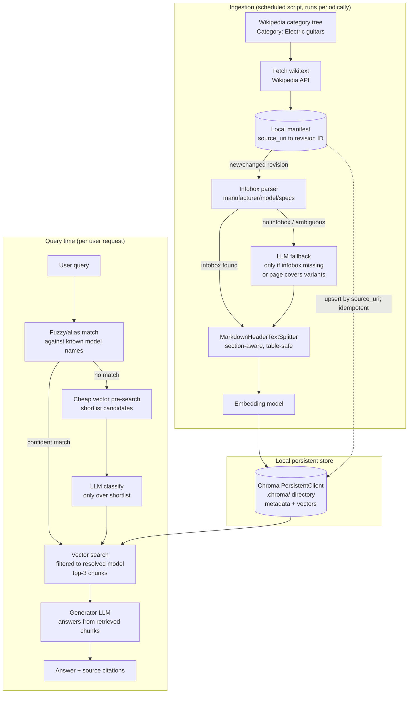

# Scaling Strategy

The current implementation (see [architecture.md](architecture.md)) is
deliberately minimal — one chunk per document, an in-memory Chroma store, a
structured-output router over 3 known models — which is the right design for
a 3-document demo corpus. This document describes what changes to grow it
into a **hobby chatbot covering every electric guitar model with a Wikipedia
article** — on the order of a few hundred to a few thousand documents, still
run by a single person on a single `OPENAI_API_KEY`. See
[limitations.md](limitations.md) for the specific problems with the current
design that motivate each change below.

Every fix below stays proportionally light for that target: a single
ingestion script and a local persistent store are enough — there's no need
for a distributed data platform to cover a few thousand documents.

## What changes, and why

### 1. Wikipedia ingestion: discovery, fetch, and infobox parsing

Today's corpus is 3 hand-written files. Growing to "every model with a
Wikipedia article" needs an ingestion script with three steps:

- **Discovery**: walk Wikipedia's `Category:Electric guitars` category tree
  (and its manufacturer subcategories) via the Wikipedia API to enumerate
  candidate article titles, instead of hand-maintaining a list.
- **Fetch**: pull each article's wikitext via the API
  (`action=query&prop=revisions|...`), respecting Wikipedia's API etiquette
  (an identifying `User-Agent`, a modest request rate) rather than scraping
  rendered HTML.
- **Parse**: most guitar articles carry an infobox template (`Infobox musical
  instrument` or similar) with structured fields — manufacturer, production
  period, scale length, body/neck wood, pickups. A wikitext parser (e.g.
  `wikitextparser` or `mwparserfromhell`) extracts these fields directly and
  deterministically, and strips templates/references from the article body to
  produce clean Markdown. This replaces the current hand-written spec table
  with the same shape of data, sourced automatically.

An LLM call is only needed as a fallback for the rare page with no infobox,
or one article covering several closely related variants (e.g. a "Fender
Stratocaster" page with sub-sections for the Player, American Professional,
and American Ultra lines) — in that case, tag the whole page with the base
model for now; splitting to variant-level metadata is a reasonable
stretch goal, not a blocker (see §3 for how sub-sectioning would carry it).

### 2. Persistent vector store + deterministic metadata

Re-embedding the whole corpus on every process start (today's in-memory
Chroma behavior) is fine for 3 documents but wasteful at a few thousand —
each restart re-spends embedding-API budget for content that hasn't changed.
Swap in Chroma's **persistent client** (`chromadb.PersistentClient(path=...)`,
writing to a local `.chroma/` directory, gitignored like `mlflow.db`), so
embeddings survive across runs.

To keep re-ingestion idempotent without a cloud event pipeline, track a small
local manifest (a SQLite table or JSON file is enough) mapping each article's
`source_uri` to the Wikipedia revision ID last ingested. A refresh run only
re-fetches, re-chunks, and re-embeds pages whose revision ID changed.

Metadata (`manufacturer`, `guitar_model`) comes directly from the infobox
parse in §1 — deterministic and free — rather than an LLM extraction pass
over every document; this keeps the ingestion script cheap to run repeatedly.

### 3. Chunking: markdown-header-aware, not whole-document

Whole-document chunking only works because today's sample corpus is 3 short,
hand-written files. A real Wikipedia article runs several sections (history,
design, notable players, variants, specifications) and can be several pages
long — too much for one embedding/context window, and too easy to blur
unrelated sections together in one chunk. Chunk by Markdown header using
LangChain's `MarkdownHeaderTextSplitter`
(`headers_to_split_on=[("##", "section"), ("###", "subsection")]`), which
keeps each section — and any infobox-derived table inside it — as one atomic
chunk, and tags each chunk with the same `manufacturer`/`guitar_model`
metadata as its parent article (or a more specific variant name, for a page
whose subsections cover distinct model variants).

### 4. Refresh cadence: a scheduled script, not an event pipeline

At this scale, a full event-driven ingestion pipeline (Blob Storage +
Event Grid + Functions) is more infrastructure than the problem needs. A
single script, run periodically (a weekly cron job, or a manual
`uv run guitar-assistant-ingest` invocation), re-walks the category tree from
§1, diffs revision IDs against the manifest from §2, and re-processes only
new or changed articles. This is idempotent by construction (upsert keyed by
`source_uri`) and comfortably fast enough at a few thousand documents to run
on a single machine.

### 5. Cost containment, if ever shared beyond one person

A single `OPENAI_API_KEY` in a local `.env` file remains the right amount of
ceremony for a project like this. The one thing worth adding *if* this ever
became reachable by other people (e.g. a shared demo link) is a lightweight
request-rate limit and a monthly spend cap/alert on the OpenAI account, so a
traffic burst can't run up an unexpected bill. A vault, a key rotation
schedule, or a proxy/gateway in front of the API would solve problems this
project doesn't have.

### 6. Routing at a few hundred models: fuzzy match first, LLM as fallback

`route`'s structured-output enum already scales mechanically (it's built at
runtime from whatever models are indexed), but a few hundred enum values
inflates every routing call's prompt and tends to hurt classification
accuracy — and most queries name a model directly anyway ("Strat", "Les
Paul", "SG"). Two-stage routing keeps the common case cheap:

- **Fuzzy/alias match first**: match the query's text against known model
  names and common aliases (e.g. via `rapidfuzz`) with no LLM call at all.
- **LLM fallback only on a miss**: if no confident match is found, run a
  cheap vector pre-search to shortlist a handful of candidate models, and
  only offer *that* shortlist (not the full corpus) as the structured-output
  schema's valid values — keeping the schema small regardless of total corpus
  size.

## Architecture

## What this plan deliberately doesn't solve

- **Embedding versioning / re-embedding cost**: if the embedding model
  changes, the whole corpus needs re-embedding once. At this scale that's a
  one-time script run, not a staged migration — not worth the dual-index
  cutover machinery a much larger deployment would need.
- **Observability** is assumed to keep using the same MLflow tracing already
  in place (see
  [architecture.md](architecture.md#inspecting-agent-execution-logs)) — no
  change needed at this scale.
- **Cross-manufacturer comparison queries** (e.g., "compare the Telecaster and
  the SG") still need the router to resolve multiple models and retrieve
  across each — the flow above generalizes to this by having the fuzzy/LLM
  step return a small list of resolved models rather than one, but that
  fan-out isn't spelled out step-by-step in the diagram above.
- **Variant-level granularity within one article** (e.g. distinguishing a
  "Player Stratocaster" from an "American Ultra Stratocaster" mentioned in the
  same page) is noted in §1/§3 as a reasonable next step, not solved here —
  today's plan tags a multi-variant page with its base model.
